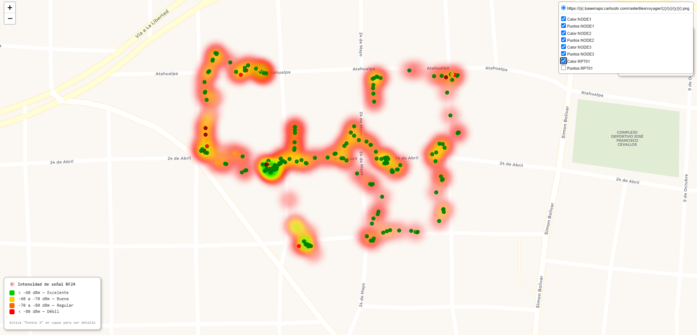

# RF24 Scanner — Python Analyzer

## Requirements
- Python 3.9+

## Installation

```bash
cd python_analyzer
pip install -r requirements.txt
```

## Usage

### All nodes
```bash
python analyzer.py scan.csv
```

### Single node only
```bash
python analyzer.py scan.csv --slot 1
```

### Custom output name
```bash
python analyzer.py scan.csv --output zone_map.html
```

## Result

Open the generated `.html` file in any browser.
It includes a heat map, node markers, a legend, and statistics.

## Color scale

| Color     | RSSI        | Quality   |
|-----------|-------------|-----------|
| Green     | > -60 dBm   | Excellent |
| Yellow    | -60 to -70  | Good      |
| Orange    | -70 to -80  | Fair      |
| Red       | < -80 dBm   | Weak      |

