# Imágenes del proyecto VinApp

Estas imágenes están preparadas para verse directamente en GitHub.

## Arquitectura general

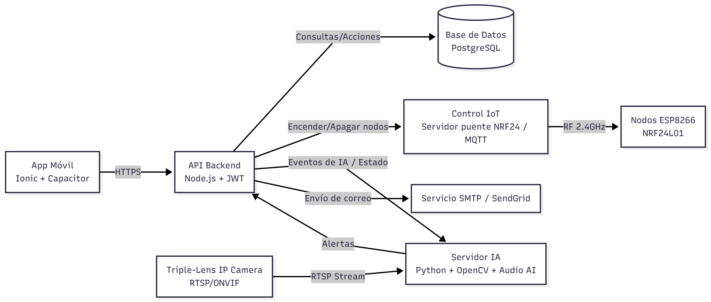

## Registro

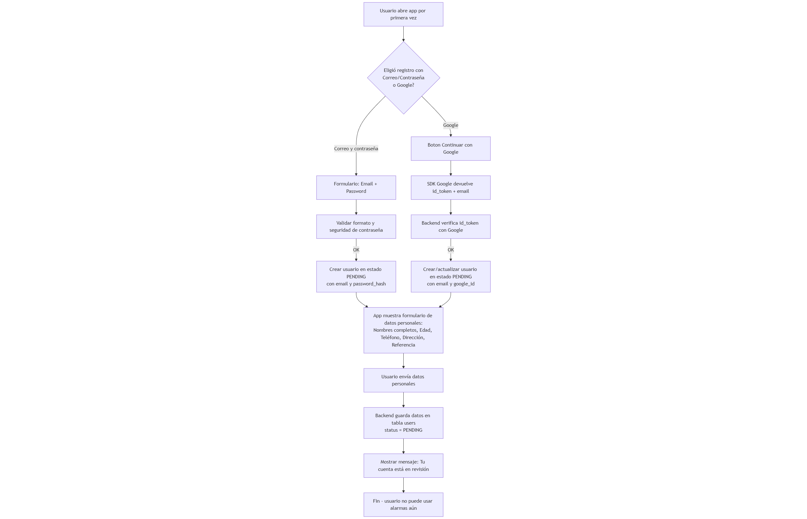

## Aprobación

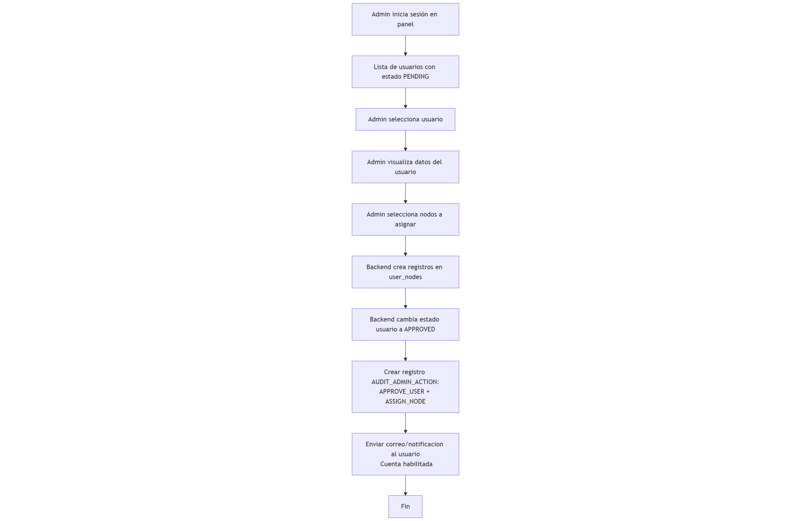

## Funcionalidades

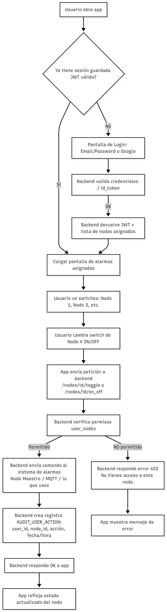

## Sistema de monitoreo IoT

## Diagramas workflow / flujos

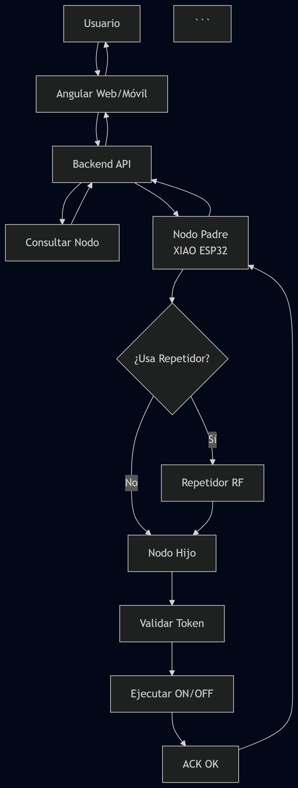

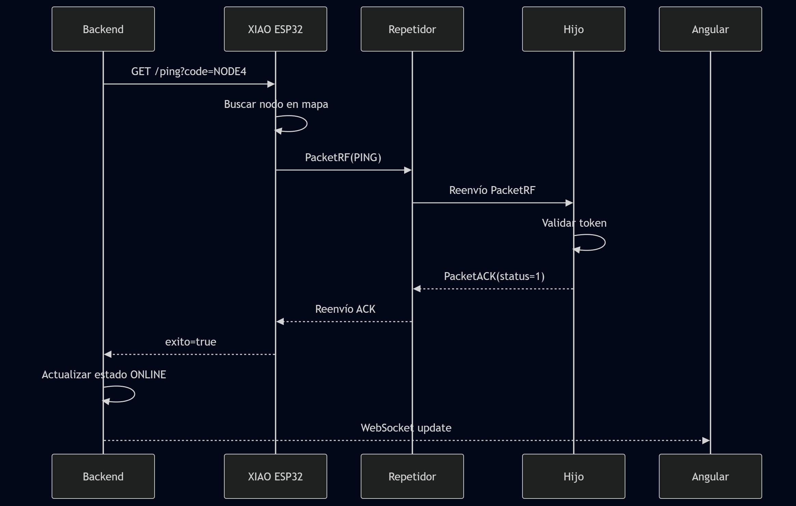

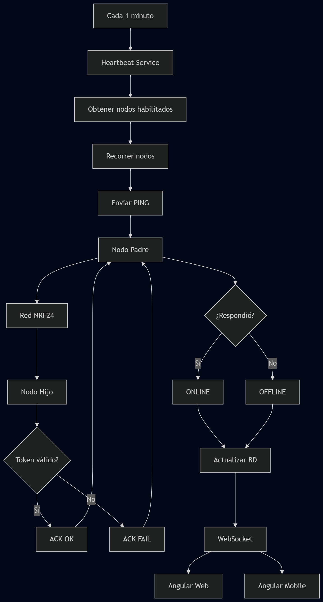

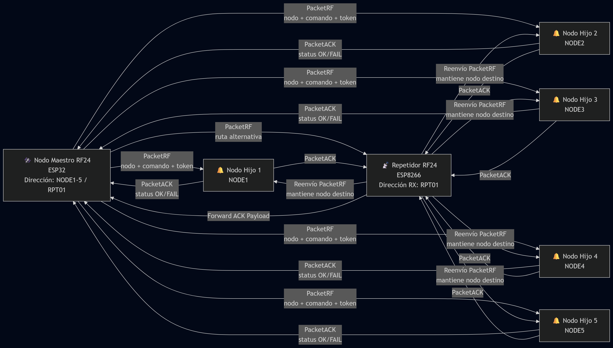

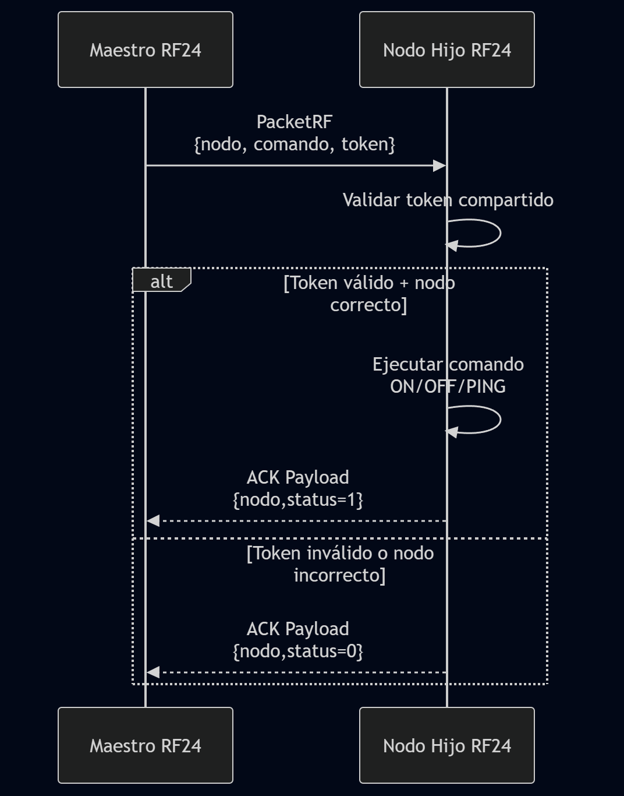

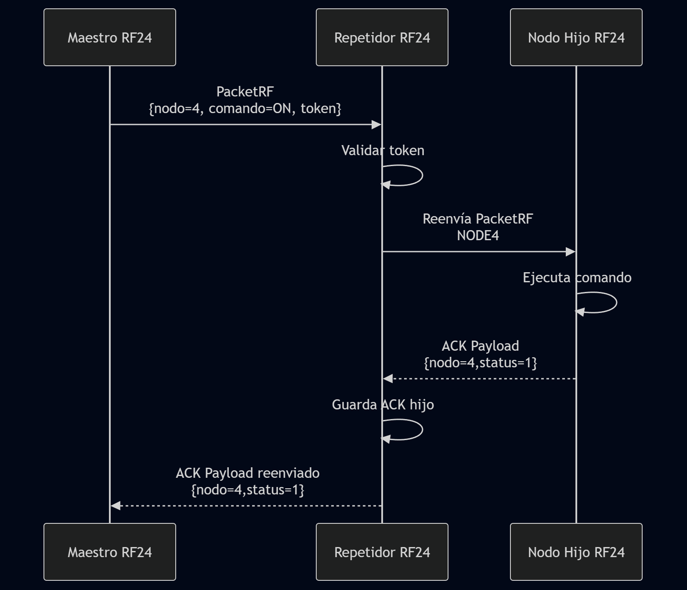

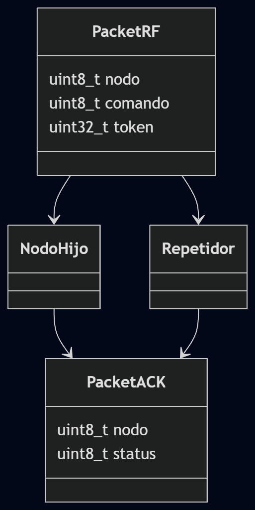

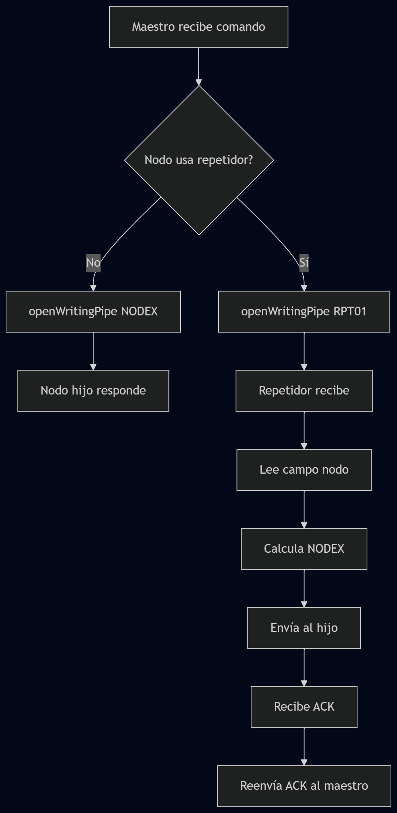

